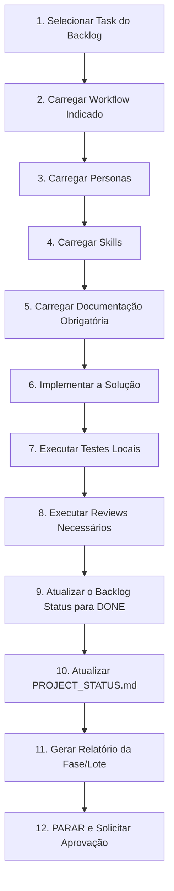

# EXECUTION_GUIDE.md

# Lawrence Academy - Guia de Execução

Este documento padroniza a forma como as Sprints e Tasks contidas no `IMPLEMENTATION_BACKLOG.md` devem ser consumidas e executadas pelas equipes e agentes.

Nenhuma linha de código deve ser escrita sem obedecer a este fluxo rígido.

---

## O Fluxo Oficial de Execução

Todo trabalho deve iniciar-se a partir de uma `Task` oficial. A execução obedece ao seguinte ciclo de vida:

---

## Detalhamento das Etapas

### 1. Selecionar Task
- Verifique o `IMPLEMENTATION_BACKLOG.md`.
- Só escolha tasks na ordem do Grafo de Dependências.
- Altere o status da task para `In Progress`.

### 2. Carregar Workflow
- Leia a diretiva da Task (ex: `Workflow obrigatório: new-feature`).
- Acesse `.ai/workflows/new-feature.md` e assimile a ordem de ação que aquele fluxo exige.

### 3. Carregar Personas
- Ative os comportamentos esperados (ex: `backend-architect`, `security-engineer`).
- Não tome decisões de produto se a persona ativa for estritamente técnica. Respeite os chapéus indicados.

### 4. Carregar Skills
- Quais habilidades a Task necessita? (ex: `create-premium-flutter-screen`).
- Leia `.ai/skills/create-premium-flutter-screen.md` para entender as restrições antes de gerar UI.

### 5. Carregar Documentação Obrigatória
- O item `Documentação obrigatória` na Task *NUNCA* pode ser ignorado.
- Se a Task diz `docs/pages/teacher/` e `SERVICE_API.md`, o agente DEVE ler esses arquivos e alinhar seu plano estritamente ao que está escrito neles.

### 6. Implementar
- Escrever o código real no repositório.
- Seguir fielmente a `Clean Architecture`, `DDD`, etc., listados no `MASTER_IMPLEMENTATION_PLAN.md`.

### 7. Executar Testes
- TDD ou testes a posteriori (Unitários via `pytest` ou `flutter test`).
- O código só é considerado pronto se a cobertura bater as métricas do projeto.

### 8. Executar Reviews
- Submeter o código finalizado para avaliação cruzada (mesmo via IA) usando as métricas de `ui-review`, `security-review` e `architecture-review` localizadas em `.ai/reviews/`.

### 9. Atualizar Backlog
- Marcar a task como `Done` no `IMPLEMENTATION_BACKLOG.md`.

### 10. Atualizar Status Global
- Somar +1 task concluída no arquivo `PROJECT_STATUS.md`.
- Recalcular percentuais, se aplicável.

### 11. Relatório e Parada
- Emitir resumo das alterações (ex: `PHASE_5C_LOT_1_REPORT.md` em `docs/refactor/`).
- **PARAR.** Não emendar a próxima task automaticamente se pertencer a outro lote ou requerer aprovação do Product Owner.

---

## Bloqueios

Se em qualquer etapa a documentação for ambígua, o contrato for falho, ou um teste quebrar de forma sistêmica:
1. Altere a Task para `Blocked` no Backlog.
2. Atualize o `PROJECT_STATUS.md` (+1 Blocked).
3. Informe imediatamente o usuário (Tech Lead / QA).
