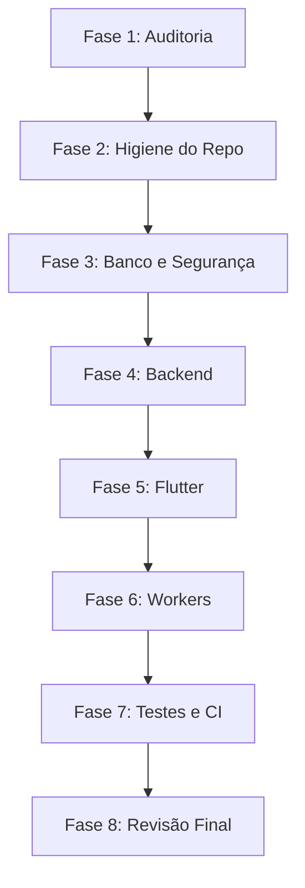

# Auditoria do Repositório — Lawrence Academy

**Versão:** 1.0.0  
**Data:** 10 de Julho de 2026  
**Responsável:** Antigravity AI Engineering Team  
**Status:** Fase de Auditoria Concluída — Aguardando Aprovação  

---

## 1. Estrutura Atual Resumida do Repositório

O repositório atual encontra-se estruturado da seguinte forma:

```text
site ariane/ (ROOT)
├── .agents/                    <-- Configurações e regras do agente (personas, reviews, rules, skills, workflows)
├── .github/                    <-- Workflows do GitHub Actions
├── AGENTS.md                   <-- Regras principais do agente
├── GEMINI.md                   <-- Instruções adicionais do agente na raiz
├── backend/                    <-- Backend FastAPI (sem .git)
│   ├── .env                    <-- Arquivo contendo segredos reais em produção (Vulnerabilidade)
│   ├── src/
│   │   ├── core/               <-- Contém entidades globais incorretamente
│   │   ├── infra/
│   │   ├── shared/
│   │   └── modules/            <-- Módulos com duas arquiteturas paralelas
│   ├── tests/                  <-- Testes unitários com mocks de DB
│   └── video-worker/           <-- Worker unificado (transcodificação + Whisper + Gemini)
├── lawrence/                   <-- Frontend Flutter
│   ├── .git/                   <-- Repositório Git localizado incorretamente no subdiretório
│   ├── .gitignore              <-- Ignora apenas itens locais do Flutter
│   ├── lib/
│   │   ├── core/               <-- Mistura de erros, router, temas e providers globais
│   │   ├── data/               <-- Repositórios e DTOs globais
│   │   ├── presentation/       <-- Controllers de tela e views (Nova Arquitetura)
│   │   ├── shared/             <-- Widgets globais de design
│   │   └── ui/                 <-- Telas e layout antigos (Arquitetura Legada com LiquidTheme)
│   └── test/                   <-- Testes básicos de validação
├── docs/                       <-- Documentação técnica e de produto
│   ├── design/
│   │   ├── COMPONENTS.md       <-- Contém na verdade a especificação de ANIMAÇÕES (Mapeamento incorreto)
│   │   └── ...
│   └── ...
└── supabase/                   <-- Configurações e Migrations do Supabase
```

---

## 2. Arquivos e Pastas Duplicados

Foram identificados arquivos e pastas duplicados ou redundantes que geram confusão no desenvolvimento:

1. **Páginas do Catálogo de Cursos:**
   * [catalog_page.dart (Legado)](file:///c:/Users/sandr/Documents/site%20ariane/lawrence/lib/ui/catalog/catalog_page.dart) (Usa `LiquidTheme`)
   * [catalog_page.dart (Novo)](file:///c:/Users/sandr/Documents/site%20ariane/lawrence/lib/presentation/catalog/views/catalog_page.dart) (Usa `LawrenceTheme`)
2. **Páginas de Detalhe do Curso:**
   * [course_detail_page.dart (Legado)](file:///c:/Users/sandr/Documents/site%20ariane/lawrence/lib/ui/public/course_detail_page.dart) (Usa `LiquidTheme`)
   * [course_detail_page.dart (Novo)](file:///c:/Users/sandr/Documents/site%20ariane/lawrence/lib/presentation/catalog/views/course_detail_page.dart) (Usa `LawrenceTheme`)
3. **Páginas do Painel do Aluno (Dashboard):**
   * [student_dashboard.dart (Legado)](file:///c:/Users/sandr/Documents/site%20ariane/lawrence/lib/ui/dashboard/student_dashboard.dart) (Usa `LiquidTheme`)
   * [dashboard_page.dart (Novo)](file:///c:/Users/sandr/Documents/site%20ariane/lawrence/lib/presentation/dashboard/views/dashboard_page.dart) (Usa `LawrenceTheme`)
4. **Temas de Estilo Paralelos:**
   * [theme.dart (Legado)](file:///c:/Users/sandr/Documents/site%20ariane/lawrence/lib/ui/theme.dart) (Define `LiquidTheme` com cores rosa/roxo pastel)
   * [theme.dart (Novo)](file:///c:/Users/sandr/Documents/site%20ariane/lawrence/lib/core/theme.dart) (Define `LawrenceTheme` seguindo o Design System 60-30-10)
5. **Configurações do Cliente Supabase:**
   * [auth_provider.dart (Linha 5)](file:///c:/Users/sandr/Documents/site%20ariane/lawrence/lib/core/auth_provider.dart#L5) (Duplica a instanciação do `supabaseClientProvider`)
   * [supabase_client.dart (Linha 5)](file:///c:/Users/sandr/Documents/site%20ariane/lawrence/lib/data/datasources/supabase_client.dart#L5) (Duplica a instanciação do `supabaseClientProvider`)
6. **Esquema de Banco de Dados e Migrations:**
   * `supabase/migrations/20260706222207_init_ariane_schema.sql` (Legado, sem tabelas de Jobs, RLS incompleto)
   * `backend/migrations/20260706_init_schema.sql` (Completo, contém RLS de Jobs, soft-delete, etc.)
7. **Documentos de Instruções para Agente:**
   * `GEMINI.md` na raiz, `backend/GEMINI.md`, `lawrence/GEMINI.md` e `docs/GEMINI.md` (Multiplos arquivos concorrentes)

---

## 3. Arquiteturas Concorrentes

### Frontend (Flutter)
Coexistem duas formas de organização e layout:
* **Arquitetura 1 (ui/):** Código acoplado diretamente a repositórios, utilizando classes e estilos do `LiquidTheme`. Os arquivos de tela residem em pastas globais como `lib/ui/admin/`, `lib/ui/catalog/`, etc.
* **Arquitetura 2 (presentation/):** Estrutura alinhada com as features, usando `LawrenceTheme`, controllers baseados em Riverpod e separação em camadas (`presentation/`, `data/`, `domain/`).

### Backend (FastAPI)
* **Arquitetura 1 (Service Pattern):** Rotas (ex: `/courses` em `src.modules.courses.api.router`) chamam diretamente `CourseService` para executar queries Supabase e retornar dicionários brutos mapeados em schemas Pydantic de apresentação.
* **Arquitetura 2 (Clean Architecture):** Rotas (ex: `/api/courses` em `src.modules.courses.interfaces.routes`) chamam `UseCase` (ex: `CreateCourseUseCase`) que invoca a interface e implementação de repositórios (`CourseRepository`) e lida com entidades de domínio (`Course`).

---

## 4. Problemas de Segurança (Vulnerabilidades Encontradas)

1. **Exposição do Client com Service Role:**
   O backend exporta e consome diretamente a instância `supabase_admin` (que possui a `service_role` key que ignora RLS) para realizar consultas de leitura comuns, como a verificação de assinaturas de estudantes na rota de vídeo streaming (ver [router.py:L64](file:///c:/Users/sandr/Documents/site%20ariane/backend/src/modules/courses/api/router.py#L64)).
2. **Política de RLS Incompleta em Perfis (Profiles):**
   A política `"Leitura pública de perfis"` em [init_schema.sql:L237](file:///c:/Users/sandr/Documents/site%20ariane/backend/migrations/20260706_init_schema.sql#L237) está configurada com `USING (true)`. Isso expõe publicamente o e-mail, código de indicação, referências e a `user_role` de todos os usuários da base.
3. **CORS Excessivamente Aberto no Backend:**
   A configuração de CORS em [config.py:L30](file:///c:/Users/sandr/Documents/site%20ariane/backend/src/shared/config.py#L30) define `allowed_origins = ["*"]` em vez de restringir aos domínios autorizados especificados em `SECURITY_COMPLIANCE_SPEC.md` (`app.lawrence.com`).
4. **Mocks de Produção Críticos (Financeiro):**
   Na rota de checkout em [routes.py:L46](file:///c:/Users/sandr/Documents/site%20ariane/backend/src/modules/payments/interfaces/routes.py#L46), caso as credenciais do Stripe falhem, a rota intercepta o erro silenciosamente e retorna um checkout bem-sucedido fictício (`mock_session`). Isso permite burlar o fluxo financeiro em produção caso as chaves expirem.
5. **Vulnerabilidade Gravíssima de RLS nas Aulas (Lessons):**
   A política de segurança RLS para visualização de lições em [init_schema.sql:L297](file:///c:/Users/sandr/Documents/site%20ariane/backend/migrations/20260706_init_schema.sql#L297) verifica se há *qualquer* assinatura ativa do usuário na tabela de subscriptions. Como a tabela não possui o campo `course_id` mapeado, assinar um curso libera o streaming de todas as aulas de outros cursos na plataforma.

---

## 5. Segredos e Arquivos Sensíveis Encontrados

1. **Chaves Reais no Backend:**
   O arquivo [backend/.env](file:///c:/Users/sandr/Documents/site%20ariane/backend/.env) contém credenciais reais do Supabase (incluindo a Service Role Key), chave secreta do Stripe, segredo de webhook do Stripe e chaves de API do Gemini/OpenAI.
2. **Secrets no Frontend Flutter:**
   O arquivo [main.dart](file:///c:/Users/sandr/Documents/site%20ariane/lawrence/lib/main.dart#L13-L14) possui credenciais fixas e expostas no código-fonte (Supabase URL e Anon Key).
3. **Ausência de Gitignore na Raiz:**
   O repositório Git está configurado apenas dentro do subdiretório `lawrence/`. Consequentemente, o arquivo `backend/.env` não está protegido contra commits acidentais caso um repositório seja criado no nível da raiz.

---

## 6. Problemas no Flutter

1. **Erros Críticos na Sincronização de Progresso Offline:**
   No controller [player_controller.dart:L192](file:///c:/Users/sandr/Documents/site%20ariane/lawrence/lib/presentation/player_controller.dart#L192), a chamada para `updateLessonProgress` envia `lastPositionSeconds`. O repositório [course_repository.dart:L44](file:///c:/Users/sandr/Documents/site%20ariane/lawrence/lib/data/repositories/course_repository.dart#L44) tenta dar um upsert passando a coluna `'last_position_seconds': lastPositionSeconds`. No entanto, na tabela real do banco de dados, o campo chama-se `watched_seconds` e a coluna `course_id` é obrigatória (`NOT NULL`), mas o frontend não a envia. Isso causará um crash fatal em produção.
2. **Desalinhamento do GoRouter com a API do Backend:**
   O controller [player_controller.dart:L96](file:///c:/Users/sandr/Documents/site%20ariane/lawrence/lib/presentation/player_controller.dart#L96) chama a URL `/api/courses/{courseId}/lessons/{lessonId}/stream`. Essa rota não existe no roteador com prefixo `/api` (apenas a rota de detalhes). O endpoint de stream está mapeado sob o prefixo `/courses/.../stream` do roteador de serviço. Isso resulta em erro 404 para o player de vídeo.
3. **Desorganização do Core:**
   A pasta `lib/core` contém providers de domínio (`auth_provider`, `download_provider`, `notifications_provider`, `subscription_provider`). O padrão de arquitetura exige que a pasta `core/` contenha apenas infraestrutura transversal (errors, storage, network, security, observability, config).
4. **Erro de Interface no ShellLayout:**
   No arquivo [shell_layout.dart](file:///c:/Users/sandr/Documents/site%20ariane/lawrence/lib/presentation/dashboard/views/shell_layout.dart), a Bottom Navigation possui o item "Atividades", mas seu clique aponta para `/admin/analytics`, gerando um desalinhamento de navegação para o aluno.

---

## 7. Problemas no Backend

1. **Mapeamento de Entidades no Core:**
   As classes de domínio `Course`, `Profile`, `Subscription` e `TaskSubmission` estão concentradas na pasta `backend/src/core/entities` em vez de pertencerem a seus respectivos bounded contexts/módulos.
2. **Ausência de Interfaces para Repositórios:**
   Os repositórios (como `TaskRepository` e `CourseRepository`) são classes concretas com métodos estáticos, violando a inversão de dependência (SOLID) e impedindo testes unitários limpos.
3. **Múltiplos Manipuladores de Exceções Redundantes:**
   As rotas FastAPI capturam exceções genéricas (`except Exception:`) e geram respostas HTTP manuais de erro 500, em vez de utilizar manipuladores de exceção globais (Exception Handlers).

---

## 8. Problemas no Supabase e Migrations

1. **Modelagem de Assinaturas (Subscriptions):**
   A tabela `public.subscriptions` não possui a coluna `course_id`. Como a regra do negócio determina que **1 curso = 1 assinatura**, a tabela deve vincular cada assinatura ao seu respectivo `course_id` e impor uma regra de unicidade para assinaturas ativas por curso/estudante.
2. **Migração Desatualizada no Supabase Local:**
   O arquivo `supabase/migrations/20260706222207_init_ariane_schema.sql` não reflete as colunas e tabelas necessárias usadas pelo backend (como `video_processing_jobs` e `stripe_processed_events`).
3. **Uso Indevido de user_id:**
   A tabela de `subscriptions` e outras utilizam `user_id` em vez de `student_id` para referenciar o aluno, quebrando a padronização e o dicionário de domínio.

---

## 9. Problemas nos Testes

1. **Mocks Silenciosos e Cobertura Baixa:**
   Os testes do Flutter não cobrem fluxos assíncronos de repositório nem validações de segurança.
2. **Ausência de Testes Automatizados de Migrations e RLS:**
   Embora exista um script `test_schema.sql` simulando testes de RLS, ele não está integrado a nenhum pipeline automatizado de validação na pasta `supabase/`.

---

## 10. Problemas na Documentação

1. **Nomes de Arquivos Fora do Padrão:**
   * `docs/navigation/Pages-Overview.md` (Deveria ser `PAGES_OVERVIEW.md`)
2. **Documento de Animações Mal Mapeado:**
   * `docs/design/COMPONENTS.md` contém a especificação de motion e animações, enquanto deveria chamar-se `ANIMATIONS.md`.

---

## 11. Código Reaproveitável

1. **Design System Visual:** Os arquivos em `lawrence/lib/shared/widgets` (`liquid_glass_card.dart`, `liquid_glass_container.dart`, `liquid_glass_sidebar.dart`, `pill_button.dart`) implementam fielmente o Liquid Glass e devem ser preservados e movidos para `design_system/components/`.
2. **Lógica de Download e Criptografia HLS:** O [download_provider.dart](file:///c:/Users/sandr/Documents/site%20ariane/lawrence/lib/core/download_provider.dart) implementa o download de segmentos HLS e criptografia AES-256 local perfeitamente e deve ser mantido, migrando para a feature `downloads`.
3. **Casos de Uso do Backend:** A lógica e validações dos Casos de Uso (ex: `GradeSubmissionUseCase`, `ListCoursesUseCase`) estão bem estruturadas e serão aproveitadas com pequenos ajustes de imports.
4. **Scripts de Teste do Banco:** A lógica do arquivo [test_schema.sql](file:///c:/Users/sandr/Documents/site%20ariane/backend/migrations/20260706_test_schema.sql) é excelente para validação transacional e será integrada à infraestrutura oficial de testes do Supabase.

---

## 12. Código Obsoleto (A ser removido na reorganização)

1. [theme.dart (Legado)](file:///c:/Users/sandr/Documents/site%20ariane/lawrence/lib/ui/theme.dart)
2. [catalog_page.dart (Legado)](file:///c:/Users/sandr/Documents/site%20ariane/lawrence/lib/ui/catalog/catalog_page.dart)
3. [course_detail_page.dart (Legado)](file:///c:/Users/sandr/Documents/site%20ariane/lawrence/lib/ui/public/course_detail_page.dart)
4. [student_dashboard.dart (Legado)](file:///c:/Users/sandr/Documents/site%20ariane/lawrence/lib/ui/dashboard/student_dashboard.dart)
5. `backend/src/modules/courses/services/course_service.py` (Substituído pela Clean Architecture oficial)
6. `backend/src/modules/students/` (Duplicação do contexto de profiles)

---

## 13. Arquivos Candidatos a Mover

1. `lawrence/lib/core/theme.dart` -> `lawrence/lib/design_system/theme.dart` (e seus tokens)
2. `lawrence/lib/shared/widgets/` -> `lawrence/lib/design_system/components/`
3. `lawrence/lib/core/auth_provider.dart` -> `lawrence/lib/features/auth/presentation/controllers/auth_controller.dart`
4. `lawrence/lib/core/subscription_provider.dart` -> `lawrence/lib/features/subscriptions/presentation/controllers/subscription_controller.dart`
5. `lawrence/lib/core/download_provider.dart` -> `lawrence/lib/features/downloads/presentation/controllers/download_controller.dart`
6. `lawrence/lib/core/notifications_provider.dart` -> `lawrence/lib/features/notifications/presentation/controllers/notifications_controller.dart`
7. `backend/src/core/entities/course.py` -> `backend/src/modules/courses/domain/entities.py`
8. `backend/src/core/entities/profile.py` -> `backend/src/modules/profiles/domain/entities.py`
9. `backend/src/core/entities/subscription.py` -> `backend/src/modules/payments/domain/entities.py`
10. `backend/src/core/entities/task_submission.py` -> `backend/src/modules/assessments/domain/entities.py`
11. `backend/video-worker/` -> `workers/video-worker/`
12. `backend/migrations/` -> `supabase/migrations/` (Unificar e padronizar histórico)

---

## 14. Arquivos Candidatos a Remover

1. `lawrence/lib/ui/catalog/catalog_page.dart`
2. `lawrence/lib/ui/dashboard/student_dashboard.dart`
3. `lawrence/lib/ui/public/course_detail_page.dart`
4. `lawrence/lib/ui/theme.dart`
5. `backend/src/modules/courses/api/router.py` (Substituído por `courses/interfaces/routes.py`)
6. `backend/src/modules/courses/api/schemas.py`
7. `backend/src/modules/courses/services/course_service.py`
8. `backend/src/modules/students/api/router.py` (Mapeado e unificado em `profiles`)
9. `backend/src/modules/students/api/schemas.py`
10. `backend/src/modules/students/services/student_service.py`
11. `supabase/migrations/20260706222207_init_ariane_schema.sql` (Legado redundante)
12. Multiplos arquivos `GEMINI.md` sobressalentes nas pastas internas.

---

## 15. Riscos por Severidade

### BLOCKER
* **Ausência do Git no nível da raiz:** Risco extremo de versionamento incompleto ou envio acidental de arquivos `.env` e caches no repositório final.
* **Vulnerabilidade Gravíssima no RLS de Lessons:** Permite que qualquer assinante acesse aulas de outros cursos sem possuir a assinatura específica.

### CRITICAL
* **Uso de Service Role para Operações Comuns:** Bypassa RLS no backend usando chaves de nível administrativo para requisições de alunos.
* **Secrets expostos em Main.dart:** Chaves de API fixadas no código do cliente.
* **Crash Fatal no Upsert de Progresso:** Mismatch de nomes de colunas (`last_position_seconds` vs `watched_seconds`) e ausência da coluna `course_id` (NOT NULL).

### MAJOR
* **Mocks de Pagamento em Produção:** Fallback que simula sessões aprovadas caso a API do Stripe falhe, gerando vulnerabilidade financeira.
* **Duas Arquiteturas Concorrentes (Flutter/Backend):** Aumenta o custo de manutenção e a chance de bugs ao manter estilos e padrões duplicados.
* **Tabela de Assinaturas Unificada:** Impede a implementação da regra de negócio de "1 curso = 1 assinatura".

### MINOR
* **Inconsistências de Nomenclatura na Documentação:** Arquivos de especificação de design e caminhos com nomes inadequados.
* **Foco Incorreto no ShellLayout:** Link de navegação direcionado para a rota errada.

---

## 16. Plano de Refatoração por Fases

O processo de reorganização está estruturado em 8 fases sequenciais e seguras:



---

## 17. Ordem Recomendada de Migração

Para minimizar quebras no sistema e garantir consistência:

1. **Fase 2 (Higiene):** Trazer o repositório Git para a raiz, criar `.gitignore` robusto e proteger segredos.
2. **Fase 3 (Segurança e Banco):** Modificar a tabela de `subscriptions` no Supabase e corrigir políticas de RLS e queries internas.
3. **Fase 4 (Backend Modules):** Mover entidades de domínio, unificar rotas e implementar interfaces de repositório.
4. **Fase 5 (Flutter Features):** Migrar telas de `/ui` para `/features` sob o `LawrenceTheme` unificado e conectar com Riverpod.
5. **Fase 6 (Workers):** Separar os workers de processamento de mídia e IA de forma isolada.

---

## 18. Dependências entre Fases

* **A Fase 3 (Banco) é pré-requisito para as Fases 4 e 5:** Alterações no banco (como adicionar `course_id` a `subscriptions` e mudar campos em `lesson_progress`) exigem a alteração correspondente no código do repositório backend (Fase 4) e no código do client Flutter (Fase 5) para que o sistema volte a funcionar.
* **A Fase 4 (Backend) é pré-requisito para a Fase 5 (Flutter):** Rotas unificadas no backend devem estar ativas para que o Flutter possa consumir os novos contratos de rede.

---

## 19. Plano de Rollback

Para cada migração/alteração nas fases:
1. **Migrations do Banco de Dados:** Todas as migrações serão escritas de forma a permitir rollback simples via comandos Supabase CLI ou scripts de reversão (ex: rollback.sql).
2. **Controle de Versão (Git):** Criação de uma branch de refatoração (`refactor/monorepo-cleanup`). Commits pequenos e focados por arquivos, facilitando o `git revert` caso algum teste quebre.
3. **Preservação de Dados de Produção:** Antes de aplicar qualquer migration na Fase 3, realizar backup lógico estrutural dos dados (profiles, subscriptions).

---

## 20. Critérios de Conclusão

A refatoração será considerada concluída quando:
1. O repositório Git estiver unificado na raiz e nenhum segredo estiver exposto no código-fonte.
2. As tabelas do Supabase refletirem a regra de "1 curso = 1 assinatura", com RLS ativado e restrito por `course_id`.
3. O backend rodar com uma única arquitetura oficial baseada em DDD (Router -> DTO -> UseCase -> Repositories).
4. O app Flutter buildar perfeitamente sem referências à pasta `ui/` legada, utilizando apenas `features/` e o `LawrenceTheme`.
5. O pipeline de testes integrados (FastAPI e Flutter) rodar com 100% de sucesso.
